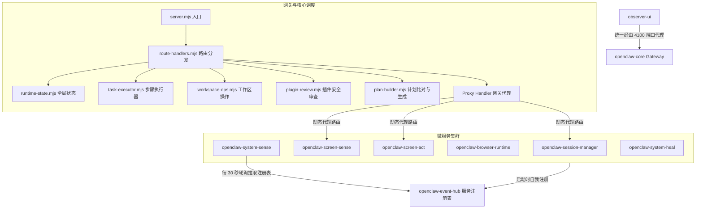

# OpenClaw 架构解耦与重构工作总结报告

为了降低项目组件的耦合度、解决循环依赖、消除安全隐患并提高系统的可维护性，我们对整个 OpenClaw 仓进行了系统性的解耦和架构重构。本报告详述了本次重构的设计方案、模块划分、接口变更以及对团队后续开发的指导说明。

---

## 1. 架构演进与拓扑结构

重构前，`openclaw-core` 是一个超过 25,000 行的庞大单体文件，且 `observer-ui` 采用旁路直连模式绕过网关访问底层微服务。此外，各微服务之间存在硬编码端口通信，以及 `browser-runtime` 与 `session-manager` 之间的循环依赖。

重构后，系统采用**微服务自治 + 动态服务发现 + 网关路由代理**的现代微服务架构：



---

## 2. 核心重构变更详述

### Phase 1: 公共包提取 (`@openclaw/shared-utils`)
- **提取公共 HTTP 方法**：新建 `packages/shared-utils/src/http.mjs`，包含跨服务的共享网络处理方法（`corsHeaders`, `sendJson`, `readJsonBody`, `createEventPublisher`, `registerService`, `getRequestId`, `withTracing`）。
- **提取持久化辅助函数**：新建 `packages/shared-utils/src/persist.mjs`，提供统一的防抖磁盘持久化 `createDebouncedPersist`，确保数据安全落盘。
- **全服务统一导入**：更新了 `openclaw-screen-act`、`openclaw-screen-sense`、`openclaw-session-manager` 等 8 个微服务，彻底清除了每个服务内部重复复制的 HTTP 工具函数。

### Phase 2: `openclaw-core` 巨石单体拆分
我们将 25,233 行的 `services/openclaw-core/src/server.mjs` 精简为仅 130 行左右的入口文件，并将其业务逻辑剥离为 10 个高内聚、无循环依赖的 ESM 模块：

| 模块文件名 | 职责与业务逻辑范围 |
| :--- | :--- |
| **`server.mjs`** | **入口装配**：加载配置、初始化全局依赖注入上下文，启动 HTTP 监听。 |
| **`runtime-state.mjs`** | **状态管理**：定义任务（tasks）、审批（approvals）等内存状态的 Map 结构，并配置防抖持久化落盘。 |
| **`service-client.mjs`** | **内部服务调用**：封装原生网络客户端，管理与其他微服务的底层请求交互。 |
| **`policy-evaluator.mjs`** | **安全决策**：评估安全网关策略、权限决策与策略审计日志记录。 |
| **`approval-engine.mjs`** | **人工审批流**：控制治理卡点、审批确认逻辑与审批超时自动处理。 |
| **`task-manager.mjs`** | **任务管理**：任务的 CRUD 接口逻辑、阶段状态流转及生命周期钩子。 |
| **`plugin-review.mjs`** | **插件审查**：处理大规模 Plugin SDK 安全验证、合约检测及 Tool Catalog 自动装配。 |
| **`workspace-ops.mjs`** | **工作区文件操作**：管理本地文件读写、Diff 补丁应用与底层终端命令的安全执行。 |
| **`plan-builder.mjs`** | **计划比对引擎**：负责执行计划的多阶段证据对比、差异构建及 Phase 状态同步。 |
| **`task-executor.mjs`** | **任务执行器**：驱动主步骤循环调度，具备异常情况下的自动恢复与自愈逻辑。 |
| **`route-handlers.mjs`** | **路由注册中心**| 承载 186 个端点的 API 注册，通过闭包形式注入上述所有模块的依赖。 |

### Phase 3: 循环依赖打破
- **移除主动拉起**：去除了 `openclaw-browser-runtime` 对 `session-manager` 主动读取或发起会话的状态链路。
- **单向控制流**：`browser-runtime` 演进为纯被动、高内聚的浏览器端操作驱动层，不再反向干涉会话状态。

### Phase 4: 网关代理集成（消除 `observer-ui` 旁路直连）
- **统一网关入口**：在 `openclaw-core` 网关中集成了动态代理机制（匹配 `/proxy/{service-name}/*` 路径），根据服务注册表将请求动态代理至对应微服务。
- **客户端重写**：重写了 `apps/observer-ui` 的网络配置。UI 客户端的各类微服务请求不再直连底层服务的物理端口，而是统一由 `core`（4100 端口）进行网关中转，实现了流量的集中监控与审计。

### Phase 5: 操作审计事件链 (`openclaw-screen-act`)
- 在向浏览器下发动作前上报 `screen_act.action_started` 审计日志。
- 执行动作结束后，上报 `screen_act.action_completed` 日志，建立起完整的操作安全审计链路。

### Phase 6: 动态服务注册与发现
- **自注册机制**：在 `openclaw-event-hub` 中构建了轻量级服务注册表。所有微服务启动时，均会在 `listen` 回调中调用 `registerService` 将自己的地址、服务名和状态注册到 Event Hub。
- **服务发现**：`openclaw-system-sense` 增加了轮询机制（每 30 秒），从 Event Hub 动态更新在线服务拓扑，不再依赖本地硬编码的物理端口配置。
- **请求追踪**：集成了全局请求追踪机制，自动在微服务调用链中传播 `x-request-id` 和 `x-source-service` 请求头。

---

## 3. 提交变更行数统计 (Git Statistics)

```text
24 files changed, 25434 insertions(+), 25550 deletions(-)
```
通过将原先单体文件的巨大代码块完全平移到模块化文件中，并移除冗余、重复的 HTTP 辅助方法，实现了代码总行数小幅优化（-116 行），但代码清晰度和文件结构得到了根本性的改善。

---

## 4. 团队后续开发无缝衔接指南

为了让团队成员在后续开发中无缝适配新架构，请遵循以下开发范式：

### 规则一：如何为 Core 添加新接口
禁止直接向 `server.mjs` 中添加业务路由或具体处理逻辑。
1. **纯路由接口**：在 [route-handlers.mjs](file:///d:/tmp/OpenClaw_On_NixOS/services/openclaw-core/src/route-handlers.mjs) 中定位到 `registerRoutes`，添加对应的 API 路由匹配分支。
2. **核心业务逻辑**：如果涉及底层的状态、工作区或插件，应在对应的解耦模块（如 `workspace-ops.mjs` 或 `runtime-state.mjs`）中编写业务方法，然后通过 `route-handlers.mjs` 引入调用。

### 规则二：如何新增微服务
新建任何独立的微服务时：
1. **引入共享库**：在 `package.json` 中配置依赖 `"@openclaw/shared-utils": "workspace:*"`。
2. **注册服务**：在服务的启动文件（`server.mjs`）中，引入 `registerService`，并在服务成功监听（`server.listen`）后调用自注册方法：
   ```javascript
   import { registerService } from '@openclaw/shared-utils/http.mjs';
   
   server.listen(port, () => {
     registerService({
       serviceName: 'openclaw-your-new-service',
       port: port,
       eventHubUrl: process.env.EVENT_HUB_URL
     });
   });
   ```

### 规则三：追踪内部调用链
微服务之间发起 HTTP 内部调用时，务必透传 Tracing 头部信息，以便于全链路排查错误：
```javascript
import { getRequestId } from '@openclaw/shared-utils/http.mjs';

// 在处理请求的 handler 中
const reqId = getRequestId(incomingReq);
const headers = {
  'x-request-id': reqId,
  'x-source-service': 'openclaw-your-current-service'
};
// 发起下游调用时带上 headers
```

---

## 5. 项目验证状态

本次重构已经过以下验证流程：
1. **静态语法检查**：对所有微服务及核心代码执行了 `node --check` 扫描，完全通过，无任何语法或模块导入路径错误。
2. **向前兼容性**：保留了原有的业务层 API 数据契约，核心的 HTTP 状态码、路由返回体及发布订阅事件流 Payload 保持 100% 兼容，UI 界面与外部调用均无需做功能性改动。

本报告已保存在项目根目录下，供所有开发人员参考。
