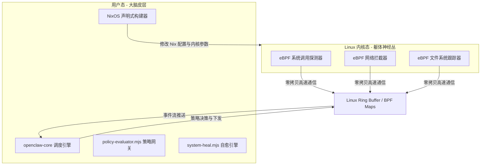

# 内核级常驻数字身体演进白皮书 (Kernel-Level Resident Digital Body Evolution Whitepaper)

本白皮书阐述了项目从“用户态系统软件”向“内核级常驻数字身体”演进的终极架构设计蓝图。该设计旨在使 AI 成为操作系统原生的一部分，实现深度的系统自我感知、高危指令内核态拦截以及声明式自适应演进。

---

## 🏛️ 1. 总体架构：混合态认知模型 (Hybrid Cognitive Model)

为了在保证系统稳定性的前提下赋予 AI 内核级的操作与感知能力，系统摒弃了将臃肿的 AI 决策大脑直接塞入内核的危险做法，采用**“用户态大脑（Cerebral Cortex） + 内核态神经网（Somatic Nerves）”**的混合架构。



### 🧠 1.1 大脑皮层 (User-space Cortex)
- **技术栈**：Node.js / TypeScript 核心微服务。
- **职责**：执行复杂的宏观规划（Planning）、目标拆解（Task Decomposition）、安全策略决策（Policy Evaluation）以及 Nix 配置文件重构。
- **优势**：在安全沙箱中运行，拥有完整的标准库支持，即使崩溃也不会导致 Kernel Panic（死机）。

### ⚡ 1.2 躯体神经丛 (Kernel-space Nerves)
- **技术栈**：利用 **eBPF (Extended Berkeley Packet Filter)** 编写的轻量级 C/Rust 内核态探测程序。
- **职责**：
  - **感官 (Sensing)**：挂载在系统调用（Syscalls）、网络协议栈、虚拟文件系统（VFS）的内核钩子上，以近乎零延迟的效率采集系统底层的微观事件。
  - **执行与拦截 (Enforcement)**：在内核层执行策略决定。例如：当检测到未授权进程试图读取敏感密钥或建立非法外网连接时，eBPF 直接在内核态阻断该 Syscall（返回 `EPERM`）或丢弃网络包（Drop），而无需经过用户态慢速处理。

### 📡 1.3 神经网络通道 (Communication Layer)
- 利用内核的 **Ring Buffer (环形缓冲区)** 和 **BPF Maps** 实现无锁、零拷贝的高速通信，解决用户态与内核态之间高频数据交换的性能瓶颈。

---

## 🔄 2. 引导生命周期融合：Stage 1 & Stage 2

为了让数字身体在操作系统的整个生命周期中都拥有感知与控制权，系统将引导流程划分为两个阶段：

### 2.1 引导阶段（Stage 1 Initrd / Initramfs） — 引导守护者
- **运行环境**：内存文件系统 (Initrd)，早于主硬盘 `/` 的挂载。
- **逻辑实现**：在 NixOS 中定制引导脚本，将一个极轻量的 Rust 引导垫片（Boot Shim）注入其中。
- **感知与控制**：
  - 在早期引导阶段检查硬件状态与加密磁盘解锁状态。
  - 如果自检通过，放行引导；如果检测到系统崩溃、磁盘挂载损坏，在 Stage 1 **直接篡改引导配置，回滚至上一个完好的 NixOS 历史 Generation 进行重启**。

### 2.2 系统运行阶段（Stage 2 Systemd） — 极早期核心
- **运行环境**：Systemd 守护进程空间。
- **生命周期绑定**：
  - 核心服务配置为 `DefaultDependencies = false` 且 `wantedBy = [ "sysinit.target" ]`。
  - **自研大脑会在网络激活、图形界面加载甚至任何普通用户空间软件启动之前完成初始化**。它通过订阅 `systemd` 的 D-Bus 接口，作为系统的第一责任人，监考整个系统的拉起流程。

---

## 🛠️ 3. 声明式系统改造循环 (Declarative Self-Mutation)

AI 对系统的自主修改不应该通过脆弱的、命令式的命令行脚本实现，而必须深度契合 NixOS 的**声明式（Declarative）哲学**：

1. **配置即基因**：
   AI 对系统的所有改造意图（如添加守护进程、修改内核参数、改变网络隔离规则），最终都通过生成或修改 `/etc/nixos/openclaw-managed.nix` 配置文件来体现。
2. **事务性构建**：
   AI 调用 `nixos-rebuild test` 对新配置进行局部编译与测试。
3. **安全自愈与物理回滚**：
   - 如果构建失败，当前活动的系统不受任何污染。
   - 如果构建成功但在运行阶段导致系统关键体征指标（Vitals）下降，自愈引擎（`system-heal`）直接触发 `nixos-rebuild switch --rollback` 自动恢复至前一个 Generation，确保系统永不“变砖”。

---

## 🚀 4. 四阶段演进路线图 (Evolution Roadmap)

为实现此白皮书愿景，项目的后续研发建议分四步走：

```
[Phase A: Nix 打包化] ──→ [Phase B: D-Bus 原生控制] ──→ [Phase C: eBPF 内核神经网] ──→ [Phase D: 声明式自进化]
```

### 🏁 Phase A: Nix 纯净化打包
- **任务**：将现有的微服务从依赖本地源码目录（`/opt/openclaw`）运行，重构为由 Nix 自动构建并打包进只读 `/nix/store` 的纯净 Derivation。
- **目标**：保证 AI 执行体的不可篡改性与运行环境的完全重现性。

### 🔌 Phase B: D-Bus 控制原生化
- **任务**：重构当前代码中的命令行执行器，引入 Node.js 版本的 D-Bus 协议客户端。
- **目标**：消灭 `systemctl` 命令行包装和免密 sudo 脚本，改用系统原生 D-Bus 信号与 Polkit 安全策略进行极细粒度的系统单元管理。

### 📡 Phase C: eBPF 内核神经网构建
- **任务**：用 C 或 Rust 编写极简的内核 eBPF 探测代码，在 NixOS 中进行内核模块装载。
- **目标**：通过 Linux Ring Buffer 将内核态的文件、进程和网络事件低延迟地推送到用户态的事件黑匣子中。

### 🔄 Phase D: 声明式自进化闭环
- **任务**：打通 Nix 配置文件生成器与 `nixos-rebuild` 执行沙箱。
- **目标**：让 AI 能够自主安全地通过改写系统声明文件来改造系统，并完成失败自动回滚 the 闭环。
